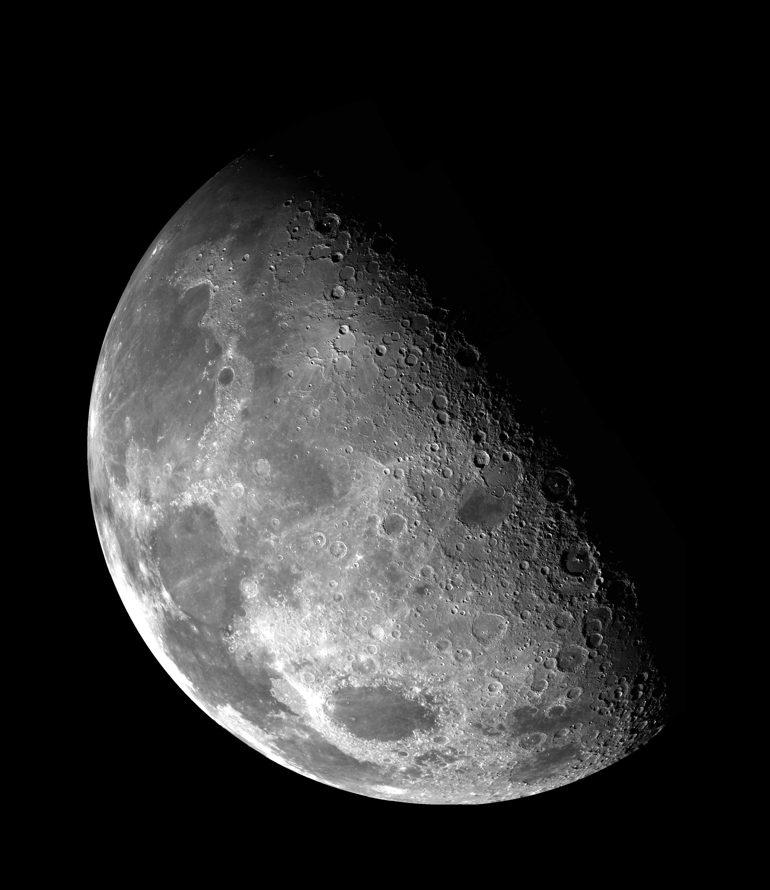
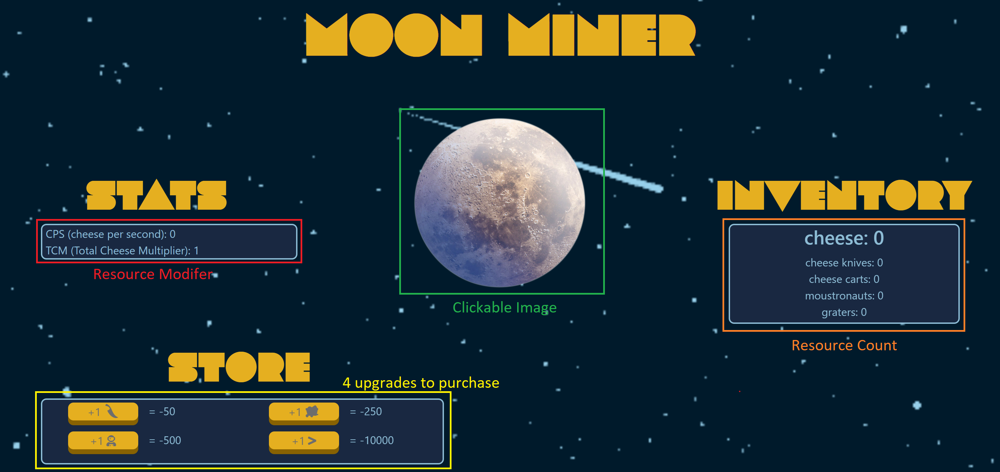

# Moon-Miner


Legend holds that the moon is made of cheese. We sent a team of astronauts and discovered that it was true! It was only a matter of time before mining this treasure became big business. Begin your corporation on their endeavor to mine the moon!

## Goals

In this checkpoint students will demonstrate their understanding of working the fundamental concepts in Vuejs to dynamically manipulate the DOM. Students are responsible for writing components to handle input and styling the page while keeping the data in sync to a vuex store.

In this example we are mining cheese from the moon, however make this your own and add whatever creative flair you choose.

## The Setup

### Create new Vue Project using the vue cli

```terminal
> vue create moon-miner
```
Be sure to include vuex when generating the new project. You will need to remove the basic boilerplate of HelloWorld.vue 

### Configure the Store

In the store.js file add the state properties you will need to keep track of the data in this project

```javascript
state:{
  cheese: 0,
}
```

### Create Components

You will need to create components to keep your code organized. Register each of these components to a single view and lay them out in a visually pleasing format. Each component should be appropriatly scoped to handle tasks that are relevant to itself. Below is an example of components you may need
```html
<template>
  <div>
    <h1>Moon Miner</h1>
    <moon />
    <store />
    <upgrades />
    <scorecard />
  </div>
</template>
```
### Upgrades

Your game must support a total of 4 upgrades, which must have two types of modifications, one for increasing the value of a click, and one that generates cheese automatically. Each time an upgrade is purchased the price of the upgrade should increase. Upgrade Costs and benefits must be easy to identify. When you have enough cheese to purchase an upgrade there must be a visual indicator that the upgrade can be purchased. There must be at least two types of upgrades and some visually depiction to identify the type of upgrade. 

#### Click Upgrades

At least one of your purchasable upgrades must be a click modifier, for instance for each `pickaxe` purchased could add +1 to your click. As an example if a user had purchased 4 pickaxes, when they click will add 1+4 to their cheese. Try to have multiple levels of these, where for example a `Cheese Cart` may give +4 per cart purchased.

#### Idle Ugrades

We also want to support the ability for the game to "play" itself while the player sits idle. Perhaps each `Rover` could add 0.5 cheese per second after being purchased.

> Don't forget to start the idle interval

### Visual Mockup


## Requirements
- [ ] User can click on an image to collect cheese
- [ ] Users have an up-to-date count of their cheese
- [ ] Users can see total cheese mined regardless of cheese spent on upgrades
- [ ] Users have at least 4 upgrades to purchase
- [ ] Users can see how many of each upgrade they have and the amount of modification that upgrade provides
- [ ] At least 1 click upgrade
- [ ] At least 1 idle upgrade
- [ ] Automatic upgrades are applied at least every 3 seconds, the screen is updated to reflect this change without user input
- [ ] Users cannot purchase an upgrade if they do not have the resources
- [ ] Upgrades have different modifier values
- [ ] When a user buys an upgrade, the price of the upgrade goes up
- [ ] Purchasables are disabled visually when they cannot be purchased
- [ ] Cheese and upgrades are keept in the store
- [ ] You must have at least 3 Vue Components
- [ ] Store data is only changed via dispatches and commits

## Stretch Goal Ideas

- Instead of a basic count, use images or icons to represent how many of a purchasable the user has
- Prevent the user from writing a loop to click by setting a 'cooldown' between clicks
- Unlock/hide upgrades until the user has enough resources at least once to afford the item
- Consider how you could add bonuses that could increase the multiplier of `automaticUpgrades`
- Try using localstorage to save your game progress between page reloads
- Create a badge system to mark user milestones ex. award "The Collector" for mining 1,000,000 total Cheese
- Create a way to decrease the interval of automaticCollection
- Prevent the IdleInterval from being started more than once

## Legal Overview

The content under the CodeWorks®, LLC Organization and all of the individual repos are soley intended for use by CodeWorks Instruction to deliver Educational content to CodeWorks Students.

---

## Copyright

© CodeWorks® LLC, 2021. Unauthorized use and/or duplication of this material without express and written permission from CodeWorks, LLC is strictly prohibited.


